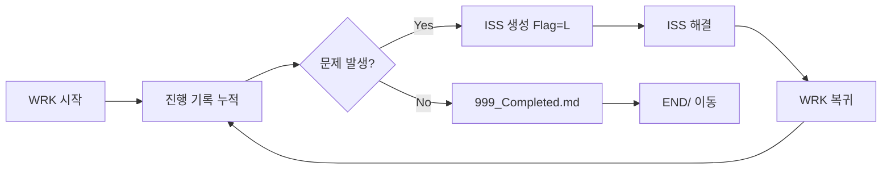

# 🌌 AOAgentDocs

> **Antigravity Standard Documentation System**
> 에이전트 기반 개발 과정에서 설계 의도와 의사결정의 타당성을 장기적으로 보존하기 위한 표준 문서 킷

[](./VERSION)

---

## 🎯 설계 목적

| 원칙 | 설명 |
|------|------|
| **클린 아키텍처 기록** | 개발 중 확정된 설계/아키텍처를 순수 로직 관점으로 문서화 |
| **기술 스택 비종속** | 프레임워크 중심이 아닌 구조적 합리성에 집중 |
| **장기 백업 지식** | 시행착오·실패 원인·우회 전략을 `communication` 체계로 축적 |

---

## 🚀 빠른 시작

### 🆕 최초 설치 (신규 프로젝트)

<details>
<summary>🤖 <b>에이전트에게 설치 요청하기 (Click to expand)</b></summary>

```text
[AOAgentDocs 신규 설치 요청]

이 프로젝트에 안티그래비티 표준 문서 시스템(AOAgentDocs v1.2.0)을 구축해주세요.

1. 설치
   git clone https://github.com/AirOut-Develop/AOAgentDocs.git
   AOAgentDocs의 CONTRIBUTING.md, RULES/, examples/ 를 프로젝트 루트로 복사

2. 초기화
   AOAgentDocs/MIGRATION_PROMPT.txt 를 읽고 초기 설정을 수행하세요.
   - docs/communication/ 구조 생성 (works/, issues/, END/, 001_INDEX.md)
   - .aodocs_version 마커 파일 생성 (내용: 1.2.0)

3. 완료 보고
   - 구축된 docs 폴더 구조를 트리 형태로 보여주세요.
```
</details>

1. 위 프롬프트를 복사하여 에이전트에게 전달
2. 또는 수동 설치:
   ```bash
   git clone https://github.com/AirOut-Develop/AOAgentDocs.git
   cp -r AOAgentDocs/{CONTRIBUTING.md,RULES,examples} <YOUR_PROJECT>/
   ```
3. `MIGRATION_PROMPT.txt`에 따라 이식 절차 수행

### 🔄 업그레이드 (기존 프로젝트)

<details>
<summary>🤖 <b>에이전트에게 업그레이드 요청하기 (Click to expand)</b></summary>

```text
[AOAgentDocs 업그레이드 요청]

현재 프로젝트의 문서 시스템을 최신 AOAgentDocs v1.2.0 체계로 업그레이드해주세요.
가장 중요한 변경점은 'WRK(작업 보고서) 체계 도입'과 '해시 기반 문서 ID' 입니다.

1. AOAgentDocs 저장소 최신화
   git clone https://github.com/AirOut-Develop/AOAgentDocs.git (이미 있으면 git pull)

2. 업그레이드 실행
   AOAgentDocs/UPGRADE_PROMPT.txt 내용을 읽고 지침에 따라 다음을 수행하세요:
   - .aodocs_version 버전 비교 (v1.1.1 -> v1.2.0)
   - 규칙 파일(RULES/COMMON/COMMUNICATION.md 등) 및 템플릿 갱신
   - 기존 ISS-NNN 이슈들을 새로운 해시 체계(ISS_YYMMDD_NNN_hash_Flag_Name)로 리팩토링
   - works/ 폴더 생성 및 END/ 아카이브 처리

3. 완료 후 보고
   - 변경된 폴더 구조와 리팩토링된 이슈 목록을 보고해주세요.
```
</details>

1. 위 프롬프트를 복사하여 에이전트에게 전달
2. 에이전트가 자동으로 **버전 비교 → 리팩토링 → 마커 갱신** 수행

---

## 📁 문서 구성

```text
AOAgentDocs/
├── CONTRIBUTING.md          ← 진입점: 작업 시작 파이프라인
├── MIGRATION_PROMPT.txt     ← 최초 설치 프롬프트
├── UPGRADE_PROMPT.txt       ← 업그레이드 자동 리팩토링 프롬프트
├── RULES/
│   ├── 000_INDEX.md         ← 규칙 인덱스 (우선순위: Platform > Common)
│   ├── 000_CHECKLIST_TEMPLATE.md
│   ├── COMMON/              ← 공통 규칙
│   │   ├── COMMUNICATION.md
│   │   ├── CODE_ETHICS.md
│   │   └── VERSION_CONTROL_CONVENTION.md
│   └── PLATFORM/            ← 플랫폼별 규칙
│       ├── ANDROID/ARCHITECTURE.md
│       ├── WEB/ARCHITECTURE.md
│       └── SERVER/ARCHITECTURE.md
├── examples/
│   ├── PROJECT_ENV_Template.md
│   └── communication/       ← WRK/ISS 운영 템플릿
├── VERSION                   ← 현재 배포 버전
├── CHANGELOG.md              ← 버전별 변경 이력
├── RELEASE_POLICY.md         ← 릴리즈 운영 기준
└── ROADMAP.md                ← 로드맵
```

---

## 📢 Communication 체계

에이전트의 작업 과정과 문제 해결을 체계적으로 기록하는 이원 체계입니다.

### WRK (작업 보고서) + ISS (이슈)

```text
docs/communication/
├── works/     ← 진행중 작업만
├── issues/    ← 진행중 이슈만
├── END/       ← 완료 즉시 이동 (아카이브)
└── 001_INDEX.md  ← WRK+ISS 통합 인덱스
```

### 네이밍 규칙

```
WRK_YYMMDD_NNN_hash_Name               ← 작업 보고서
ISS_YYMMDD_NNN_hash_Flag_Name          ← 이슈
     ──────  ───  ──────  ───  ────
     날짜    순서  고유ID  플래그  이름
```

| 세그먼트 | 설명 |
|---------|------|
| `YYMMDD` | 생성 날짜 (1차 정렬) |
| `NNN` | 해당 날짜 내 순서 (2차 정렬, WRK/ISS 독립 카운트) |
| `hash` | 6자리 hex 고유 ID — SHA-256 앞 6자리, 생성 시 1회 확정 |
| `Flag` | `L`(WRK 연계) / `S`(독립) — ISS에만 적용 |

### 작업 흐름



### 핵심 규칙
- **해시는 Primary Key** — 인덱스 조회 없이 즉시 채번 가능 (충돌 불가)
- **ISS(`L`)에는 부모 WRK 해시 필수** — 양방향 추적
- **완료 즉시 `END/`로 이동** — `works/`와 `issues/`에는 진행중만
- **중간 발견은 즉시 기록** — 종료까지 기다리지 않음
- **보안 필수** — 토큰·비밀번호·키 마스킹 처리

---

## 📦 릴리즈

| 항목 | 링크 |
|------|------|
| 버전 정책 | [RELEASE_POLICY.md](./RELEASE_POLICY.md) |
| 변경 이력 | [CHANGELOG.md](./CHANGELOG.md) |
| 로드맵 | [ROADMAP.md](./ROADMAP.md) |
| 현재 버전 | [VERSION](./VERSION) |

**패키징:**
```bash
# Linux / WSL
./scripts/release_package.sh

# Windows (PowerShell)
./scripts/release_package.ps1
```

**배포 전 체크:**
- `RELEASE_POLICY.md`의 보안 감사 게이트 충족 확인
- 이슈/PR/릴리즈 보안 점검 완료
- 배포 태그: `aodocs/vX.Y.Z`

